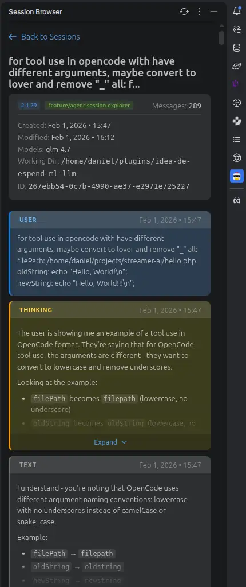
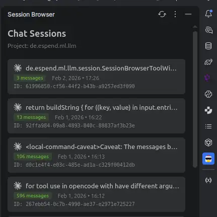
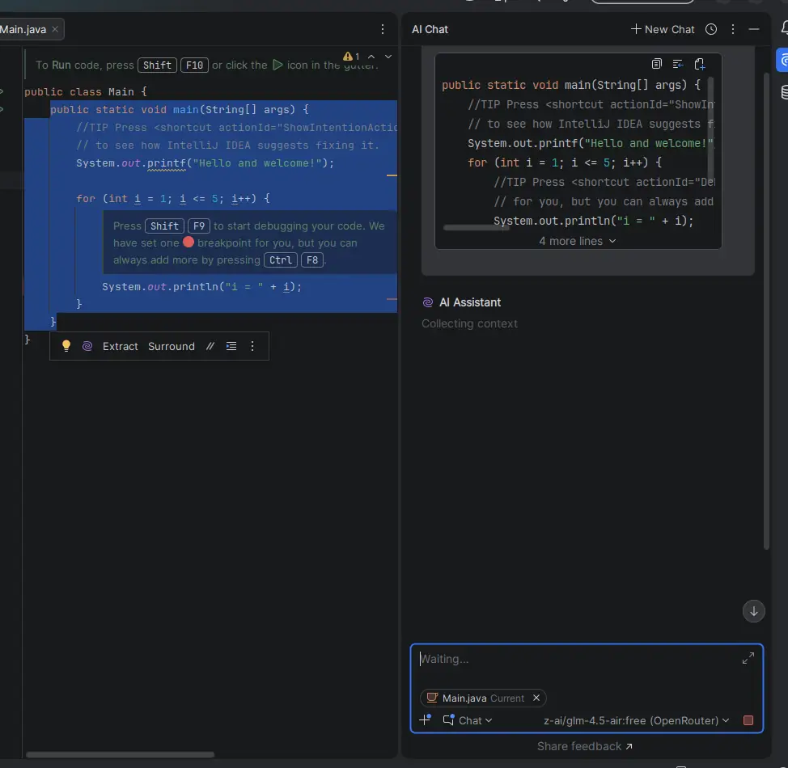
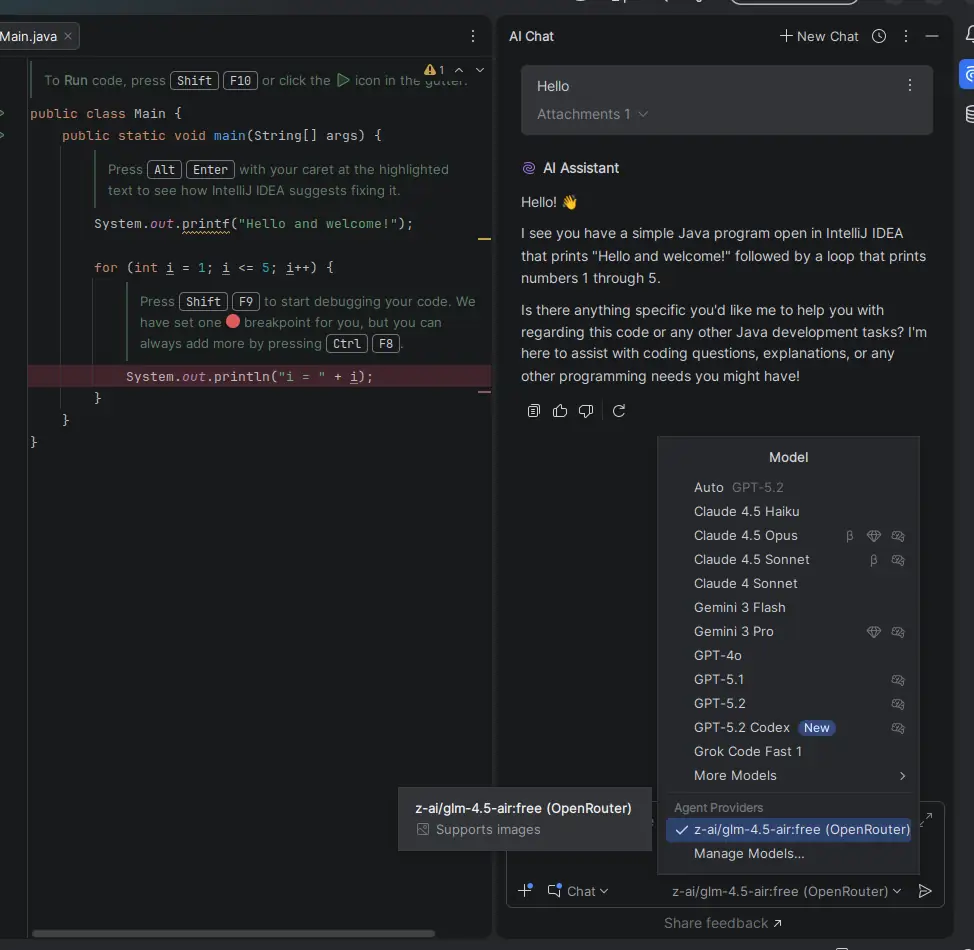
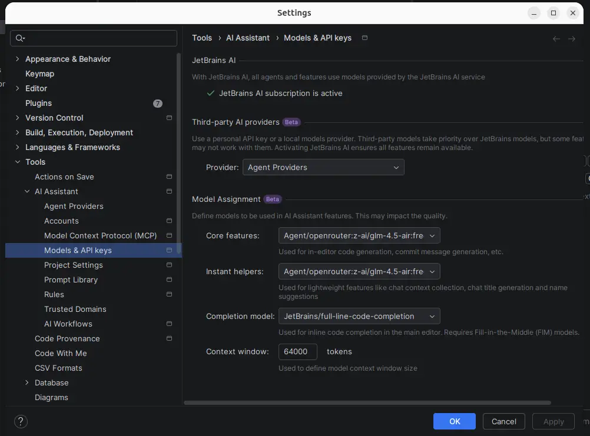

# AI Assistant Providers / Sessions for IntelliJ IDEA

[![zread](https://img.shields.io/badge/Ask_Zread-_.svg?style=flat&color=00b0aa&labelColor=000000&logo=data%3Aimage%2Fsvg%2Bxml%3Bbase64%2CPHN2ZyB3aWR0aD0iMTYiIGhlaWdodD0iMTYiIHZpZXdCb3g9IjAgMCAxNiAxNiIgZmlsbD0ibm9uZSIgeG1sbnM9Imh0dHA6Ly93d3cudzMub3JnLzIwMDAvc3ZnIj4KPHBhdGggZD0iTTQuOTYxNTYgMS42MDAxSDIuMjQxNTZDMS44ODgxIDEuNjAwMSAxLjYwMTU2IDEuODg2NjQgMS42MDE1NiAyLjI0MDFWNC45NjAxQzEuNjAxNTYgNS4zMTM1NiAxLjg4ODEgNS42MDAxIDIuMjQxNTYgNS42MDAxSDQuOTYxNTZDNS4zMTUwMiA1LjYwMDEgNS42MDE1NiA1LjMxMzU2IDUuNjAxNTYgNC45NjAxVjIuMjQwMUM1LjYwMTU2IDEuODg2NjQgNS4zMTUwMiAxLjYwMDEgNC45NjE1NiAxLjYwMDFaIiBmaWxsPSIjZmZmIi8%2BCjxwYXRoIGQ9Ik00Ljk2MTU2IDEwLjM5OTlIMi4yNDE1NkMxLjg4ODEgMTAuMzk5OSAxLjYwMTU2IDEwLjY4NjQgMS42MDE1NiAxMS4wMzk5VjEzLjc1OTlDMS42MDE1NiAxNC4xMTM0IDEuODg4MSAxNC4zOTk5IDIuMjQxNTYgMTQuMzk5OUg0Ljk2MTU2QzUuMzE1MDIgMTQuMzk5OSA1LjYwMTU2IDE0LjExMzQgNS42MDE1NiAxMy43NTk5VjExLjAzOTlDNS42MDE1NiAxMC42ODY0IDUuMzE1MDIgMTAuMzk5OSA0Ljk2MTU2IDEwLjM5OTlaIiBmaWxsPSIjZmZmIi8%2BCjxwYXRoIGQ9Ik0xMy43NTg0IDEuNjAwMUgxMS4wMzg0QzEwLjY4NSAxLjYwMDEgMTAuMzk4NCAxLjg4NjY0IDEwLjM5ODQgMi4yNDAxVjQuOTYwMUMxMC4zOTg0IDUuMzEzNTYgMTAuNjg1IDUuNjAwMSAxMS4wMzg0IDUuNjAwMUgxMy43NTg0QzE0LjExMTkgNS42MDAxIDE0LjM5ODQgNS4zMTM1NiAxNC4zOTg0IDQuOTYwMVYyLjI0MDFDMTQuMzk4NCAxLjg4NjY0IDE0LjExMTkgMS42MDAxIDEzLjc1ODQgMS42MDAxWiIgZmlsbD0iI2ZmZiIvPgo8cGF0aCBkPSJNNCAxMkwxMiA0TDQgMTJaIiBmaWxsPSIjZmZmIi8%2BCjxwYXRoIGQ9Ik00IDEyTDEyIDQiIHN0cm9rZT0iI2ZmZiIgc3Ryb2tlLXdpZHRoPSIxLjUiIHN0cm9rZS1saW5lY2FwPSJyb3VuZCIvPgo8L3N2Zz4K&logoColor=ffffff)](https://zread.ai/Haehnchen/idea-de-espend-ml-llm)
[](https://plugins.jetbrains.com/plugin/7219)
[](https://plugins.jetbrains.com/plugin/7219)
[](https://plugins.jetbrains.com/plugin/7219)

Configure and use multiple AI providers as chat Agent in IntelliJ IDEA's AI Assistant chat. Includes a Session Browser for viewing chat sessions from external AI tools.

| Key                  | Value                                      |
|----------------------|--------------------------------------------|
| Plugin Url           | https://plugins.jetbrains.com/plugin/29900 |
| ID                   | de.espend.ml.llm                           |

## Features

- **AI Providers**: Configure and use multiple AI providers with IntelliJ's AI Assistant
- **Session Browser**: Browse and view chat sessions from Claude Code, Codex CLI, and OpenCode

## AI Providers

Configure multiple AI providers through **Settings → AI Assistant → Agent Providers**.

| Provider | Description | Register |
|----------|-------------|----------|
| **Claude CLI** | Uses Claude Code's built-in Anthropic integration | - |
| **Anthropic Compatible** | Any Anthropic-like API (via `@zed-industries/claude-code-acp`) | - |
| **Gemini** | Google's Gemini CLI | - |
| **OpenCode** | The OpenCode CLI | - |
| **Cursor** | The Cursor Agent CLI (via `@blowmage/cursor-agent-acp`) | - |
| **Z.AI** | Z.AI via Anthropic Compatible API | [Register](https://z.ai/subscribe?ic=BCLQG4VJIO) |
| **OpenRouter** | OpenRouter via Anthropic Compatible API | - |
| **And more...** | MiniMax, Mimo, Moonshot, Requesty.ai, Nano-GPT, AIHubMix, Factory.ai | - |

## Session Browser

Browse and view chat sessions from external AI tools directly in the IDE.

**Location**: Available in the AI Assistant chat toolbar and in the right sidebar.

| Source          | Description |
|-----------------|-------------|
| **Claude Code** | Chat sessions from Claude Code CLI |
| **Codex CLI**   | Chat sessions from JetBrains AI Assistant CLI |
| **OpenCode**    | Chat sessions from OpenCode CLI |
| **Amp**         | Chat sessions from ampcode.com |

## Installation

1. In IntelliJ IDEA, go to **File → Settings → Plugins**
2. Click the **Marketplace** tab
3. Search for **Agent Providers**
4. Click **Install**

### Using AI Providers

1. Go to **Settings → AI Assistant → Agent Providers**
2. Configure API keys and base URLs as needed
3. Click **Apply** to register the agents
4. For CLI-based providers, install the corresponding npm package, e.g.:
   ```bash
   npm install -g @zed-industries/claude-code-acp
   ```
5. **Important**: To use providers for core AI features (commit generation, AI actions):
   - Go to **Settings → Tools → AI Assistant → "Models & API keys"**
   - Select **"Agent Providers"** from the provider dropdown
   - Select a model from the model dropdown

### Using the Session Browser

The Session Browser works out of the box - no additional setup required. Simply open it from **View → Tool Windows → Session Browser**.

## Requirements

- IntelliJ IDEA (or any JetBrains IDE with AI Assistant support)
- AI Assistant plugin must be installed
- Node.js with npm (for CLI-based providers)


## Images













